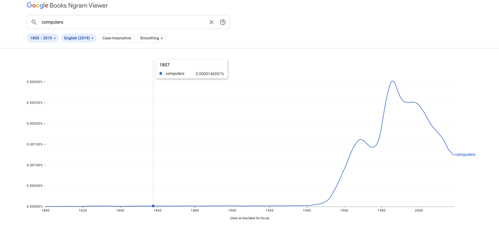

# Narrative - Ngram

## What are N-grams and how are they used to build a language model?
N-grams are adjacent sequences of N items from a given text or sequence.
In NLP, these are usually words, but could be charactersm syllables, or other linguistic units.

Language models are statistical models that try to capture patterns and structures of language to generate new text that sounds natural. (human made)
N-grams are a common technique for building language models because they provide a simple and effective way to model the conditional probability of a word given its previous words.

To build language models using N-grams, we first create a frequency distribution of all the N-grams that occur in our training data.
Then, when we want to generate new text, we use this frequency distribution to predict the probability of the next word given the previous N-1 words.
We can use these probabilities to choose the most likely next word or to sample a new word based on the probabilities.

## Applications of N-grams
- Text classification
- Speech recognition
- Machine translation
- Spell checking and correction

## How probabilities are calculated
### Unigrams
Unigrams consider the frequency of individual words in a corpus.
The probability of a word w in a unigram model is calculated as the frequency of the word divided by the total number of words.

### Bigrams
Bigrams consider the frequency of pairs of adjacent words in a corpus.
The probability of a word w given the previous word v in a bigram model is calculated as the frequency of the bigram (v,w) divided by the frequency of the previous word v.

## Importance of the source text in building a language model
It is extremely important in building a language model using N-grams.
The model is trained on a corpus of text. This is used to estimate the probability distribution of the N-grams.
If the source text is small, unrepresentative, or biased, the model will most likely not be able to capture the full complexity and diversity of the language.
This overall leads to poor performance.

## The importance of smoothing
Smoothing is a technique in NLP used to address the problem of zero probabilities/low-frequency events in language modeling.
It's common in N-gram models for some n-grams to have 0 counts in the training corpus, especially when the source text is small.
This can lead to underestimation of probabilities/poor performances of the model.
Smoothing helps to reduce the sparsity of probability distribution and to avoid overfitting of training data.

### A simple approach to smoothing
A simple approach is Laplace smoothing, as seen in this project.
This is also known add-k smoothing. The idea behind it is to adda constant k to each count in the training data before computing the probabilities.
The value of k is typically set to 1. This is basically like adding a "pseudocount" of 1 to each n-gram in the vocabulary.

## How language models can be used for text generation
By sampling from the probability distribution of the next word given the previous words in the sequence.
A seed text/prompt as initial context can be used. Given the previous words, the most probable word an be iteratively smapled and appended to the generated text.
This can be done until a maximum length is reached or a specific token generated.

### Limitations
A limitation of this approach can be the lack of coherence in the generated text. This will eventually happen in longer sentences.
The generated text is most likely semantically and syntatically correct, but won't have thematic consistency, as they don't have a global understanding of the text structure or the underlying meaning.

## How language models can be evaluated
They can be evaluated like any other machine learning model. By accuracy: how often the model predicts the correct word given the previous words.
It can also be evaluated by humans. As mentioned in the previous paragraph, lack of coherence is a limitation to language models generating texts.
Humans will notice those lacks, and therefore be able to adjust models.

## Google's n-gram viewer
This is an online tool that allows users to search and analyze the frequency of words/phrases in the Google Books corpus. This contains millions of books published between 1800 and 2019.
This tool can be used to explore trends/patterns in the use of language over time.

### Example using the word "computers"
This word's frequency started to rise in the mid 1940s and had its peak in the mid 80s.
